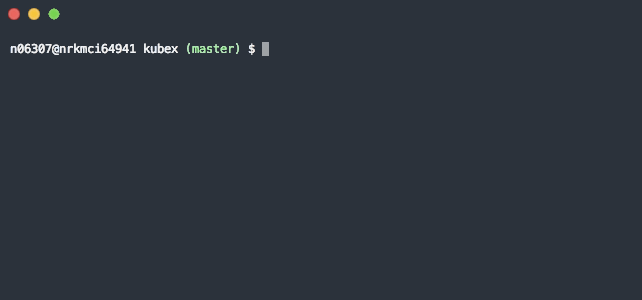

[](https://www.npmjs.com/package/kubex) [](https://tolu.mit-license.org/)

# kubex
Interactive cli helper for kubectl

> Tired of listing all alternatives just to be able to switch context or namespace - then this is for you

You'll need to have [`kubectl`](https://kubernetes.io/docs/tasks/tools/install-kubectl/) installed in path

## Install

```
$ npm i -g kubex
```

## Usage

```
$ kubex -h

  Usage: kubex [command] [options]

    Interactive <kubectl> helper

    Options:

      -V, --version     output the version number
      -d, --debug       verbose output
      -h, --help        output usage information

    Commands:

      set-context|ctx   select kubectl context
      set-namespace|ns  select kubectl namespace
```

### What it looks like
Notice that the current context/namespace is the default selected option




## Dependencies

 - [commander](https://www.npmjs.com/package/commander) - solution for building node.js cli
 - [inquirer](https://www.npmjs.com/package/inquirer) - interactive cli lists
 - [clui](https://www.npmjs.com/package/clui) - cli spinner

## Inspiration

 - https://www.sitepoint.com/javascript-command-line-interface-cli-node-js/
 - https://scotch.io/tutorials/build-an-interactive-command-line-application-with-nodejs

## License

MIT @ https://tolu.mit-license.org/
